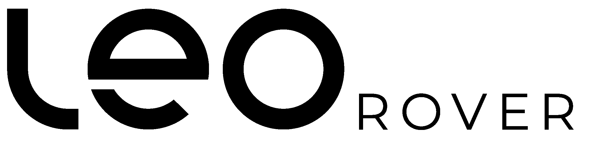

    

## Hi there 👋

 
<h4>ROS developer / Software Engineer</h4>

Leo Rover is a stable mobile robot you can deploy outdoors as it’s watertight and built tough enough for an extreme environment.

My responsibilities:
- integrating additional modules into the rover
- creating systems for custom usage of the rover
- developing software running on the rover
  

#### Continuum Rover Team
Continuum is a studet association at the University of Wrocław that focuses on rovers
* Gained experience in developing with ROS (Robot Operating System)
* Took an active part in the development of the Aleph 1 and Aleph 2 mars rover prototypes
* Represented the team on the ERC remote competitions in 2021 and 2020

---------------------------------------------------------------------------

    <samp>
        Technologies
    </samp>

<table align="center" width="80%">
    <tr>
        <td>
            
        </td>
        <td>
             
        </td>
        <td>
            
        </td>
        <td>
            
        </td>  
    </tr>
    <tr>
        <td>
            
        </td>
        <td>
            
        </td>
       <td>
            
        </td>
        <td>
            
        </td>
    </tr>
    <tr>
        <td>
            
        </td>
        <td>
            
        </td>
        <td>
            
        </td>
         <td>
            
        </td>
    </tr>
</table>

  

<!--
**Bitterisland6/Bitterisland6** is a ✨ _special_ ✨ repository because its `README.md` (this file) appears on your GitHub profile.

Here are some ideas to get you started:

- 🔭 I’m currently working on ...
- 🌱 I’m currently learning ...
- 👯 I’m looking to collaborate on ...
- 🤔 I’m looking for help with ...
- 💬 Ask me about ...
- 📫 How to reach me: ...
- 😄 Pronouns: ...
- ⚡ Fun fact: ...
-->
